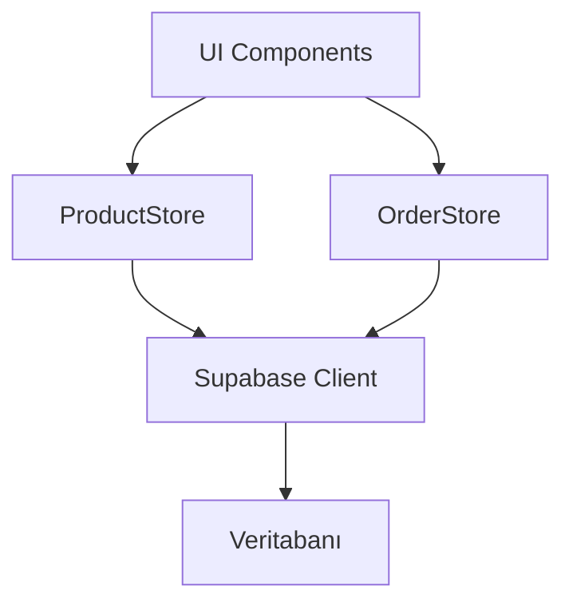

# Product Context

## Project Purpose
Super Cafe AI is a cafe management system designed for Windows 10/11 platforms, built as an Electron desktop application. It provides a comprehensive solution for internet cafe operations with client-server architecture.

## Core Problems Solved
- Authentication and user management
- Session management for cafe computers
- Client-side cafe service access
- Real-time communication between staff and customers

## Target Platform
- Windows 10/11 (Primary platform)
- Electron-based desktop application
- Cross-platform architecture but optimized for Windows

## Key Features
1. Authentication System
   - Email/Password authentication
   - Session persistence
   - Protected routes
   - Role-based access control

2. Client Interface
   - Clean and modern UI
   - Responsive design
   - Efficient navigation
   - Real-time updates

## Technical Requirements
- Windows 10/11 compatibility
- Electron for desktop integration
- Supabase for backend services
- Real-time data synchronization

# Product Context - Computer Management

## User Stories

### Computer Scanning
As a cafe staff member, I want to:
- Scan the network for available computers
- See scan progress in real-time
- Get notifications about scan results
- Add found computers automatically

### Computer Management
As a cafe staff member, I want to:
- View all computers in a table format
- Add computers manually if needed
- See computer status in real-time
- Group and filter computers
- Track computer usage history

### Monitoring
As a cafe admin, I want to:
- Monitor computer status changes
- Get alerts for disconnected computers
- View computer usage analytics
- Generate computer usage reports

## UI/UX Requirements

### Table View
- Clear status indicators
- Easy-to-read layout
- Quick actions for common tasks
- Responsive design for all screens

### Notifications
- Toast messages for actions
- Status change alerts
- Network scan results
- Error notifications

### Forms
- Simple computer addition
- Field validation
- Clear error messages
- Quick submission process

## Future Enhancements
1. Advanced Filtering
   - Status-based filters
   - Usage time filters
   - Group-based filters

2. Analytics Dashboard
   - Usage patterns
   - Peak hours
   - Revenue per computer
   - Maintenance scheduling

3. Automation Features
   - Auto-refresh status
   - Scheduled scans
   - Automatic maintenance alerts
   - Usage optimization suggestions

# Ürün Yönetim Sistemi

## Sistem Yapısı

### Client-Side Stores
- ProductStore: Ürün ve kategori yönetimi
- OrderStore: Sepet ve sipariş yönetimi

### Veri Akışı


## Bileşenler

### 1. Ürün Listeleme
- Kategori bazlı filtreleme
- Grid ve liste görünümleri
- Lazy loading desteği

### 2. Kategori Yönetimi
- Kategori ekleme/düzenleme/silme
- Hiyerarşik kategori yapısı
- Kategori bazlı ürün görüntüleme

### 3. Sepet Yönetimi
- Ürün ekleme/çıkarma
- Miktar güncelleme
- Toplam fiyat hesaplama
- Sepet özeti

### 4. Sipariş İşlemleri
- Sipariş oluşturma
- Ödeme entegrasyonu
- Sipariş takibi
- Geçmiş siparişler

## Arayüz Tasarımı

### Ürün Kartı
```typescript
interface ProductCard {
  id: string;
  name: string;
  price: number;
  description?: string;
  image_url?: string;
  stock_quantity: number;
  category: Category;
}
```

### Kategori Yapısı
```typescript
interface Category {
  id: string;
  name: string;
  description?: string;
  parent_id?: string;
}
```

### Sipariş Modeli
```typescript
interface Order {
  id: string;
  customer_id: string;
  items: OrderItem[];
  total_amount: number;
  status: OrderStatus;
  payment_status: PaymentStatus;
  created_at: Date;
}
```

## State Management

### Product Store
```typescript
interface ProductState {
  products: Product[];
  categories: Category[];
  selectedCategory: string | null;
  isLoading: boolean;
  error: string | null;
}
```

### Order Store
```typescript
interface OrderState {
  cart: CartItem[];
  orders: Order[];
  isLoading: boolean;
  error: string | null;
}
```

## Gelecek Geliştirmeler

1. Ürün Özellikleri
   - Varyant desteği
   - Özelleştirilebilir ürün seçenekleri
   - Toplu ürün yönetimi

2. Stok Yönetimi
   - Otomatik stok güncellemesi
   - Stok alarmları
   - Tedarik zinciri entegrasyonu

3. Raporlama
   - Satış analizleri
   - Ürün performans raporları
   - Stok hareket raporları
